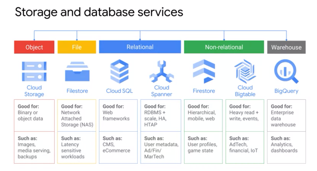

# Collections






## List



```csharp
using System;
using System.Collections.Generic;

public class Program
{
	public static void Main()
	{

		List<string> lst = new List<string>();

		// Adding data to list
		lst.Add("uday");
		lst.Add("uday2");
		lst.Add("uday3");

		// Accessing and modifying data in list
		Console.WriteLine($"All hail {lst[0]}");
		lst[0] = "uday yadav";
		Console.WriteLine($"Correction : All hail {lst[0]}");

		Console.WriteLine("Variants");
		foreach (var variant in lst)
		{
			Console.WriteLine($"variant : {variant}");
		}

		// Insert at position 1, moving all elements to right
		lst.Insert(1, "uday2 yadav");
		Console.WriteLine("Variants");
		foreach (var variant in lst)
		{
			Console.WriteLine($"variant : {variant}");
		}

		lst.Add(null);
		// removes the first occurance of null
		lst.Remove(null);
		// removes the third element in list
		lst.RemoveAt(3);
		// remove the first occurence matching this
		lst.Remove("uday2 yadav");

		Console.WriteLine("Variants");
		foreach (var variant in lst)
		{
			Console.WriteLine($"variant : {variant}");
		}

		// Find whether the element is in the list or not
		Console.WriteLine(lst.Contains("uday yadav"));
		Console.WriteLine(lst.Contains("uday yadav2"));

		// sort the list
		lst.Sort();
	}
}
```

| Method | Usage |
| :--- | :--- |
| Add | Adds an element at the end of a List&lt;T&gt;. |
| AddRange | Adds elements of the specified collection at the end of a List&lt;T&gt;. |
| BinarySearch | Search the element and returns an index of the element. |
| Clear | Removes all the elements from a List&lt;T&gt;. |
| Contains | Checks whether the specified element exists or not in a List&lt;T&gt;. |
| Find | Finds the first element based on the specified predicate function. |
| Foreach | Iterates through a List&lt;T&gt;. |
| Insert | Inserts an element at the specified index in a List&lt;T&gt;. |
| InsertRange | Inserts elements of another collection at the specified index. |
| Remove | Removes the first occurrence of the specified element. |
| RemoveAt | Removes the element at the specified index. |
| RemoveRange | Removes all the elements that match the supplied predicate function. |
| Sort | Sorts all the elements. |
| TrimExcess | Sets the capacity to the actual number of elements. |
| TrueForAll | Determines whether every element in the List&lt;T&gt; matches the conditions defined by the specified predicate. |

## SortedList


```csharp
using System;
using System.Collections.Generic;

public class Program
{
	public static void Main()
	{
		SortedList<int, string> numberNames = 
			new SortedList<int, string>();
		numberNames.Add(3, "Three");
		numberNames.Add(1, "One");
		numberNames.Add(2, "Two");
		numberNames.Add(4, null);
		numberNames.Add(10, "Ten");
		numberNames.Add(5, "Five");

		foreach (KeyValuePair<int, string> pair in numberNames)
		{
			Console.WriteLine("{0} = {1}", pair.Key, pair.Value);
		}

		// key to [] should be in sortedList
		Console.WriteLine($"Element : {numberNames[1]}");

		// ContainsKey
		if (numberNames.ContainsKey(4))
		{
			numberNames[4] = "four";
		}
		Console.WriteLine($"Element : {numberNames[4]}");

		// tryGetValue
		string result = "";
		if (numberNames.TryGetValue(4, out result))
			Console.WriteLine("Key: {0}, Value: {1}", 4, result);

		// remove element from sortedList
		numberNames.Remove(1);

		// iterate sortedList using for loop
		for (int i = 0; i < numberNames.Count; i++)
		{
			Console.WriteLine("key: {0}, value: {1}", 
			numberNames.Keys[i], numberNames.Values[i]);
		}
	}
}
```

## Dictionary


```csharp
using System;
using System.Collections.Generic;

public class Program
{
	public static void Main()
	{
		IDictionary<int, string> numberNames = 
			new Dictionary<int, string>();
		#
		numberNames.Add(1, "One"); 
		//adding a key/value using the Add() method
		numberNames.Add(2, "Two");
		numberNames.Add(3, "Three");

		//The following throws run-time exception: 
		// key already added.
		//numberNames.Add(3, "Three"); 

		foreach (KeyValuePair<int, string> kvp in numberNames)
			Console.WriteLine("Key: {0}, Value: {1}", 
			 kvp.Key, kvp.Value);

		//creating a dictionary using collection-initializer 
		var cities = new Dictionary<string, string>(){
			{"UK", "London, Manchester, Birmingham"},
			{"USA", "Chicago, New York, Washington"},
			{"India", "Mumbai, New Delhi, Pune"}
		};

		foreach (var kvp in cities)
			Console.WriteLine("Key: {0}, Value: {1}", 
			 kvp.Key, kvp.Value);

		Console.WriteLine(cities["UK"]);
		Console.WriteLine(cities["USA"]);

		//use ContainsKey() to check for an unknown key
		if (cities.ContainsKey("France"))
		{
			Console.WriteLine(cities["France"]);
		}

		//use TryGetValue() to get a value of unknown key
		string result;

		if (cities.TryGetValue("France", out result))
		{
			Console.WriteLine(result);
		}

		if (cities.ContainsKey("France"))
		{
			cities["France"] = "Paris";
		}

		cities.Remove("UK");
		// removes UK 

		//cities.Remove("France"); 
		//throws run-time exception: KeyNotFoundException

		if (cities.ContainsKey("France"))
		{
			// check key before removing it
			cities.Remove("France");
		}

		//removes all elements from the dictionary
		cities.Clear();
	}
}
```

## Hashtable

```csharp
using System;
using System.Collections;
using System.Collections.Generic;

public class Program
{
	public static void Main()
	{
		Hashtable numberNames = new Hashtable();
		numberNames.Add(1, "One"); 
		//adding a key/value using the Add() method
		numberNames.Add(2, "Two");
		numberNames.Add(3, "Three");

		//The following throws run-time exception: 
		// key already added.
		//numberNames.Add(3, "Three"); 

		foreach (DictionaryEntry de in numberNames)
			Console.WriteLine("Key: {0}, Value: {1}", 
			 de.Key, de.Value);

		//creating a Hashtable using collection-initializer 
		var cities = new Hashtable(){
			{"UK", "London, Manchester, Birmingham"},
			{"USA", "Chicago, New York, Washington"},
			{"India", "Mumbai, New Delhi, Pune"}
		};

		string citiesOfUK = (string)cities["UK"]; 
		//cast to string
		string citiesOfUSA = (string)cities["USA"]; 
		//cast to string

		Console.WriteLine(citiesOfUK);
		Console.WriteLine(citiesOfUSA);

		cities["UK"] = "Liverpool, Bristol"; 
		// update value of UK key
		cities["USA"] = "Los Angeles, Boston"; 
		// update value of USA key

		if (!cities.ContainsKey("France"))
		{
			cities["France"] = "Paris";
		}
		// removes UK 
		cities.Remove("UK"); 
		//cities.Remove("France"); 
		//throws run-time exception: KeyNotFoundException

		if (cities.ContainsKey("France"))
		{ // check key before removing it
			cities.Remove("France");
		}

		cities.Clear();
	}
}
```

