# GCP Core Infra

## Why Core Infrastructure

* Identify the purpose and value of Google Cloud
* Choose best deployment environment
* Choose storage options
* Interact and experience google cloud

### GCP service categories

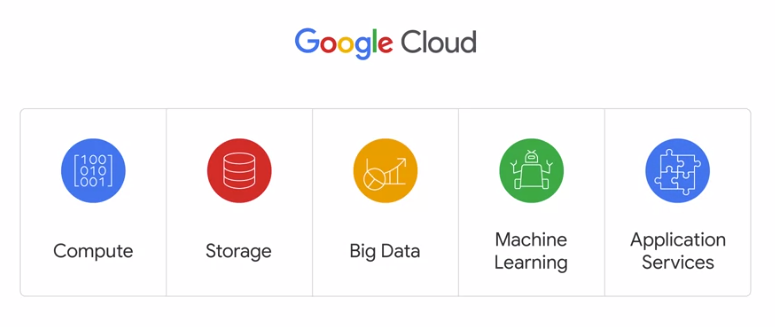

### Cloud advantages

### Evolution of cloud

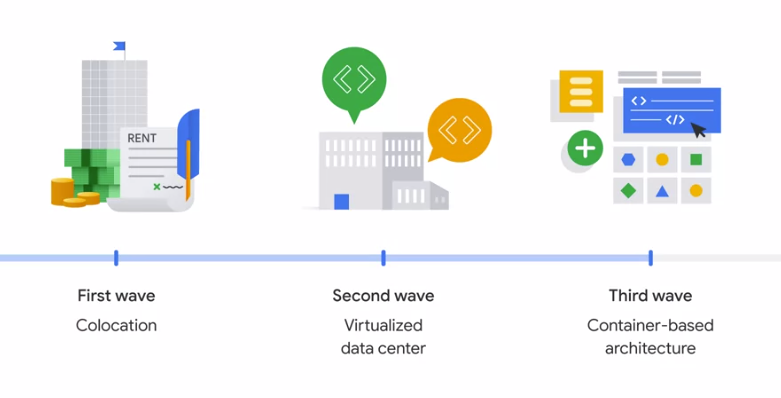

### Infrastructure as service

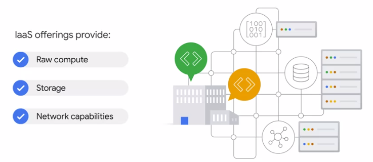

* IaaS : Pay for what they allocate
* PaaS : Pay for what they use

### Cloud structure

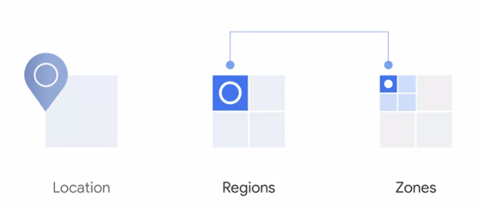

Google's nine products have more than one billion users each. Google designs and builds its own data centers, which incorporate multiple layers of physical security protections. Access to these datacenters is limited to only a very small number of Google employees. Security features include encryption using centrally managed keys and hardware encryption in hard drives and SSDs. The GFE additionally applies protections against denial-of-service attacks. Google also has multi-tier, multi-layer DoS protections that further reduce the risk of any DoS impact on a service running behind the GFE.

### Cloud cost

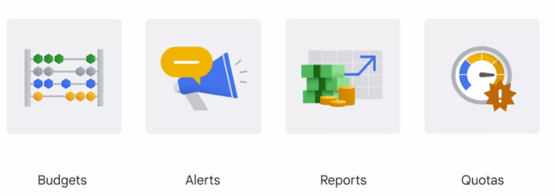

Specifically, when you run an instance for more than 25% of a month, Compute Engine automatically gives you a discount for every incremental minute you use for that instance. Custom virtual machine types allow Compute Engine virtual machines to be fine tuned with optimal amounts of vCPU and memory for the applications so that you can tailor your pricing for your workloads.

### Project structure gcp

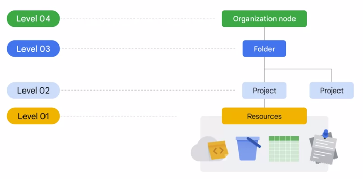

* folder can contain sub folders
* policies are applied at project, folder and org node level
  * some can be applied at resource level
  * policies are inherited downwards

### Projects in GCP

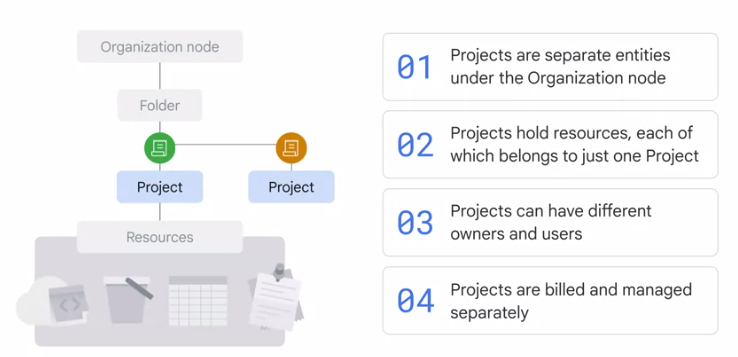

Attributes of project

* project\_id
* project\_name
* project\_number

### Info about projects

### Resource manager

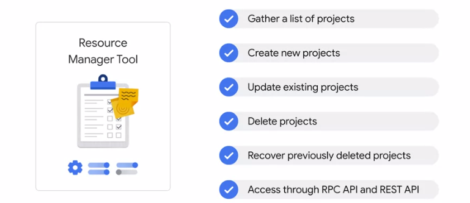

### Organization nodes

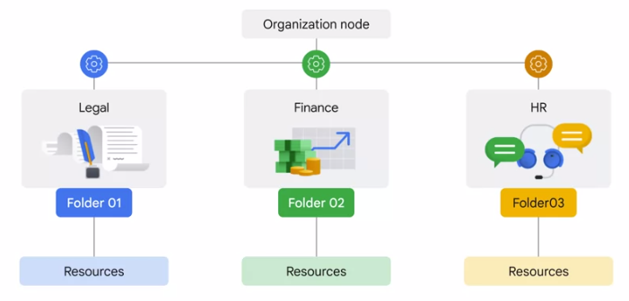

### Top level of org

who can do what and on which part

* who can be :
  * a google account
  * a google group
  * service account
  * cloud identity domain
* can do what
  * defined by a role

### Types of IAM

**Basic role**

* Owner
* Editor
* Viewer
* Billing Admin

Can be too general when working with sensitive data

### Basic IAM role

### Pre-define IAM role

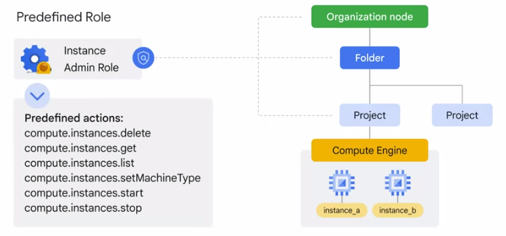

### Custom IAM role

### Custom IAM role

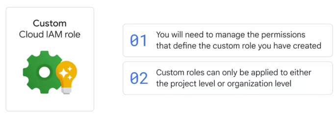

* service accounts do need to be managed

### Service account

### Cloud identity

* more on cloud identity

### Ways to access gcp

## Quiz

Q1 : When would you choose to have an organization node? (Select two)

* When you want to create folders
* When you want to centrally apply organization-wide policies

Q2 : Which statement best describes how Google Cloud resources are associated within the resource hierarchy?

* Google Cloud resources are not associated with the resource hierarchy.

Q3 : Consider a single hierarchy of Google Cloud resources. Which of these situations is possible? (Choose 3 responses.)

* There is no organization node, and there are no folders.
* There is an organization node, and there is at least one folder.

Your company has two Google Cloud projects and you want them to share policies. What is the least error-prone way to set this up?

* Define the new shared policy in the organization node.

Q5 : What is the difference between Identity and Access Management (IAM) basic roles and IAM predefined roles?

* Basic roles can only be granted to single users. Predefined roles can be associated with a group.

Q6 : Select the option that displays IAM roles from general to specific.

* Predefined roles, custom roles, basic roles

Q7 : How does the resource hierarchy control how IAM policies are inherited?

* IAM policies are only implemented at the project level; they cannot be amended by lower levels of the resource hierarchy.

Q8 : Which way of accessing Google Cloud lets you control services through the code you write?

* APIs

### Type of VPC

### What is vpc

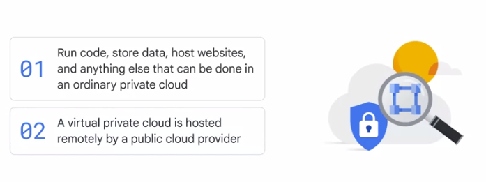

### Info on VPC

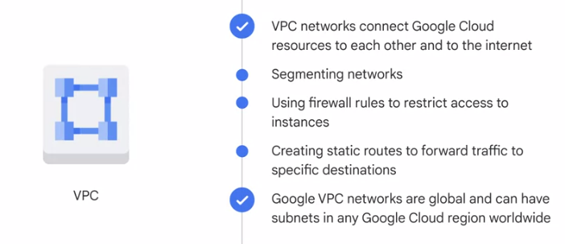

### What is compute engine

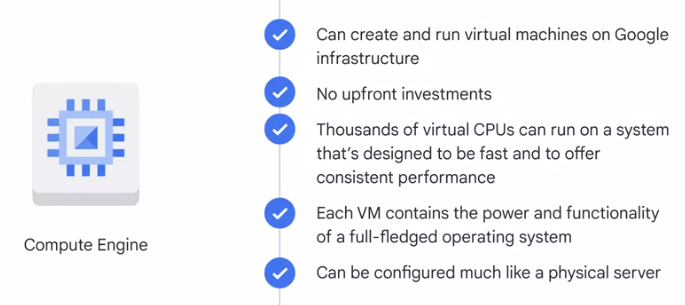

<figure><figcaption>
range of compute services
</figcaption></figure>

<figure><figcaption>
virtual machine VM lifecycle
</figcaption></figure>

### What are virtual machine

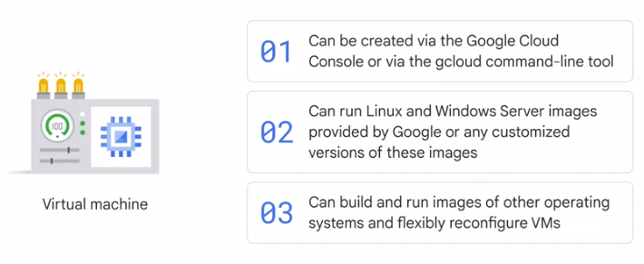

### VM and disk relation

A preemptible VM is different from an ordinary Compute Engine VM in only one respect. Compute Engine has permission to terminate a job if its resources are needed elsewhere. Although savings are possible with preemptible VMs, you need to ensure that your job can be stopped and restarted. In terms of storage, Compute Engine doesn't require a particular option or machine type to get high-throughput between processing and persistent disks.

Let's say, you have a workload that doesn't require a human to sit and wait for it to finish, such as a batch job analyzing a large dataset. You can save money, in some cases up to 90 percent by choosing preemptible VMs to run the job

### Autoscale vs manual scale

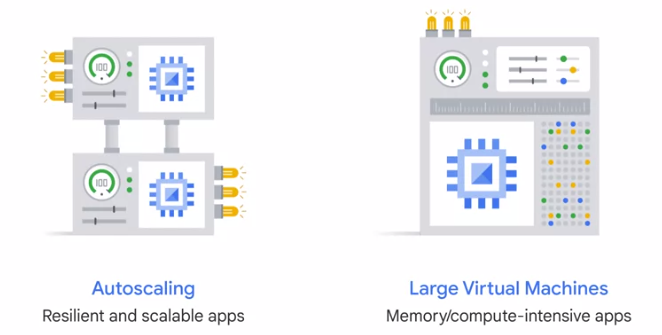

### VM upper limit

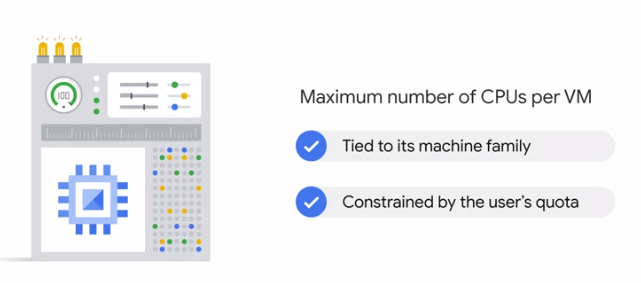

<figure><figcaption>
general purpose virtual machone
</figcaption></figure>

<figure><figcaption>
compute optimized virtual machone
</figcaption></figure>

<figure><figcaption>
memory optimized virtual machone
</figcaption></figure>

<figure><figcaption>
preemptible virtual machine
</figcaption></figure>

<figure><figcaption>
spot virtual machine
</figcaption></figure>

### Routing tables

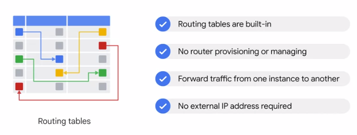

### Firewall in GCP

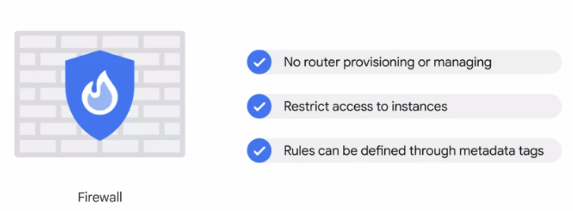

### DNS 

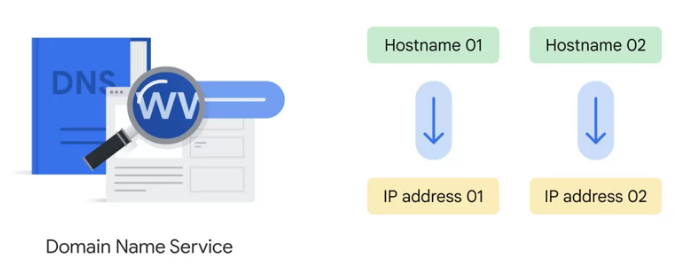

### Google's DNS

###  Managed DNS

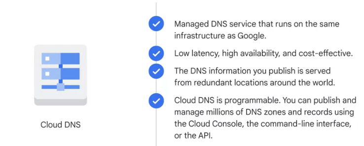

### Cloud CDN

### type of networking

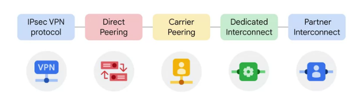

### IPsec VPN protocol

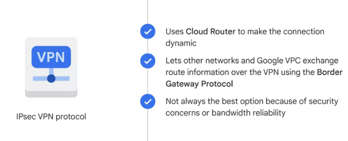

### Direct peering

### Carrier peering

### Dedicated interconnect

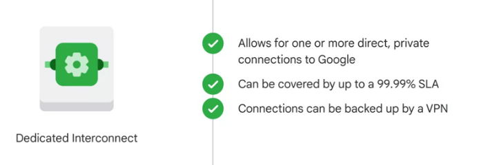

### Partner interconnect

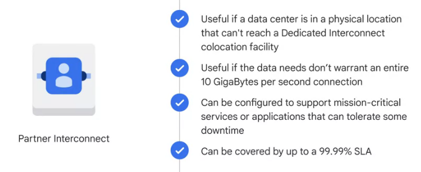

### Blob in storage bucket

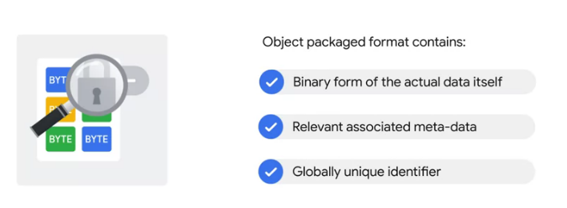

### GCP cloud storage bucket

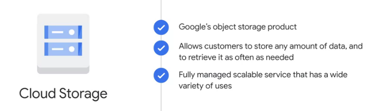

### Why use cloud storage

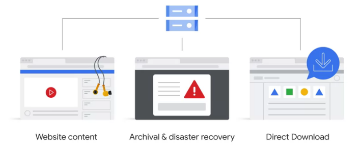

### Blob

### Object version in storage bucket

* Object versioning

### Scope and permisson object storage

### Type of storage options

### Type of storage options

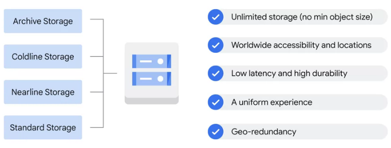

### Storage options

### Cloud SQL

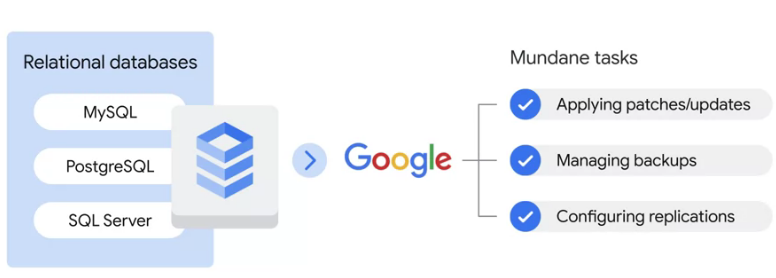

### More info on cloud SQL

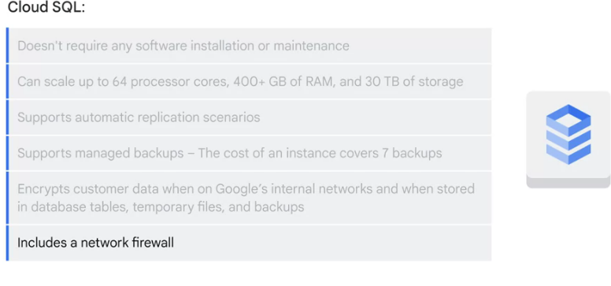

### Intro to cloud spanner

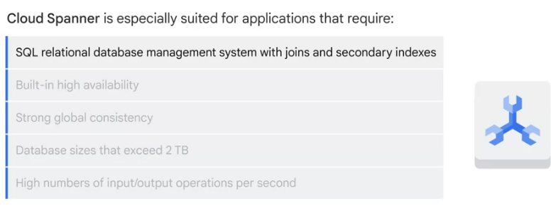

### Intro to firestore

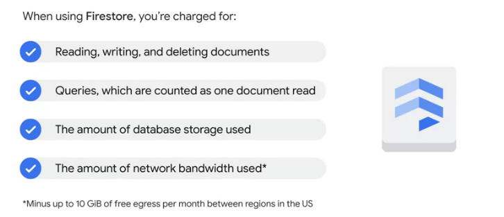

### Intro to bigtable

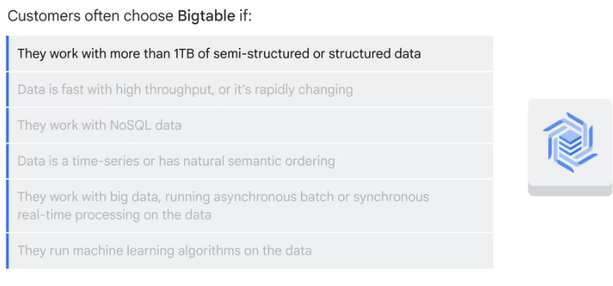

### Type database to choose

### What is a container

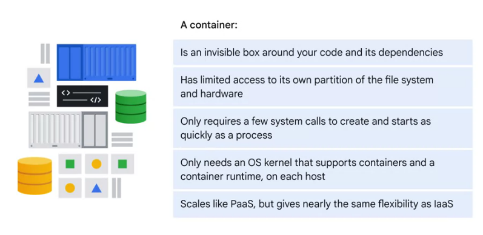

### What is kuberentes

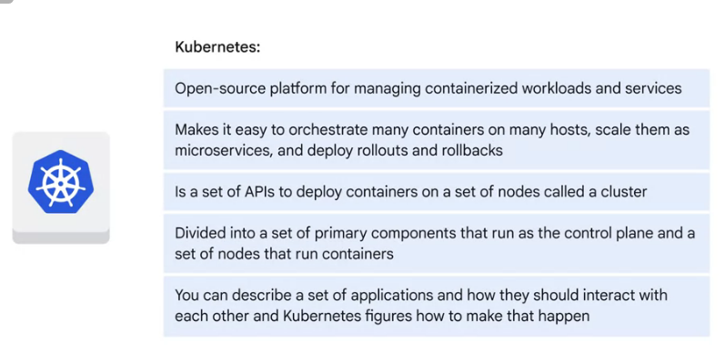

### Kubernetes cluster

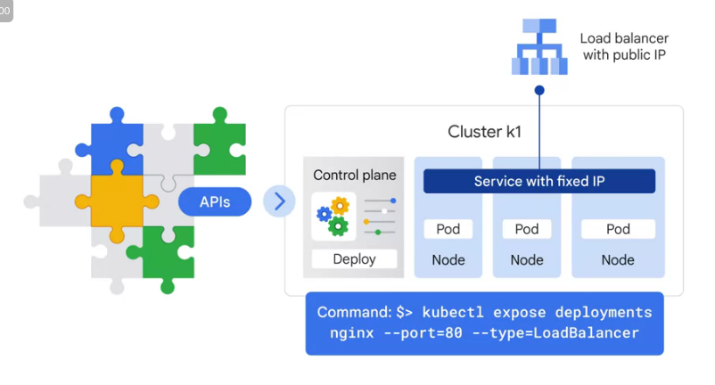

### Google managed Kubernetes Engine

### Hybrid and multi-cloud 

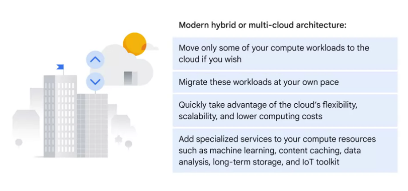

### Anthos

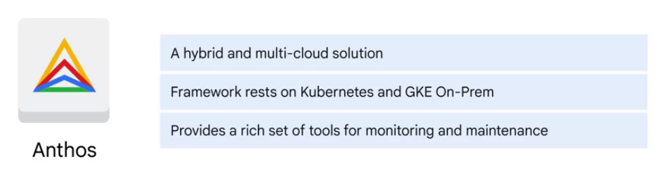

### GKE

### GKE autopilot

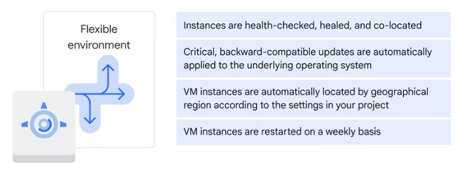

### microservice in gCP

### Why container

### Standard env vs flexible env

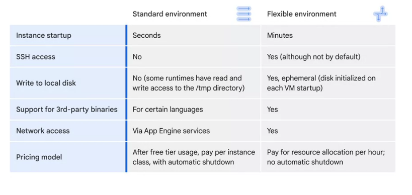

### cloud endpoints

### APIgee Engine

### Cloud RUN

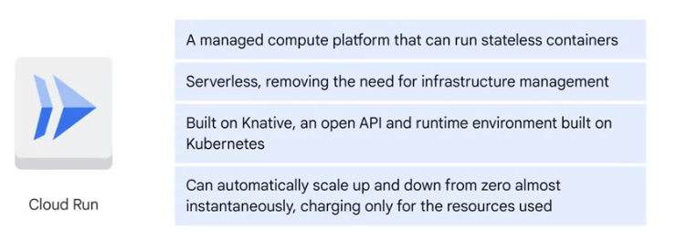

### Simple deployment model

### Cloud functions

### Intro to terraform

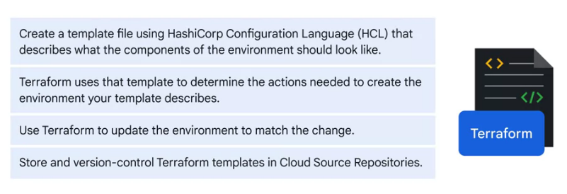

### What is SRE

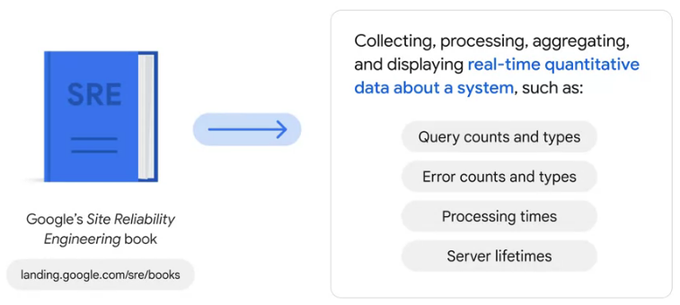

### Monitoring

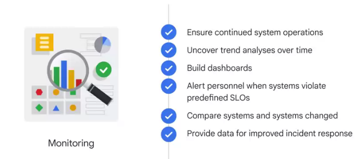

### SRE pyramid

### SRE job

### Latency

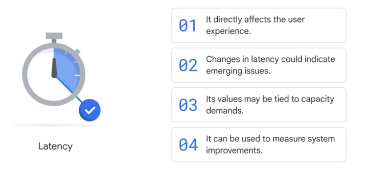

### Latency

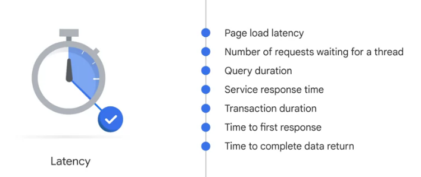

### Traffic

### Traffic part2

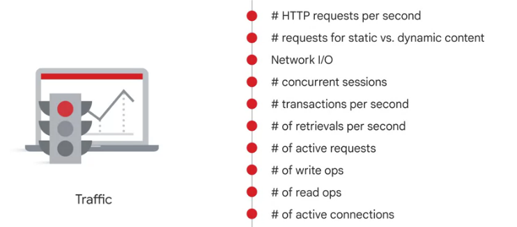

### Saturation

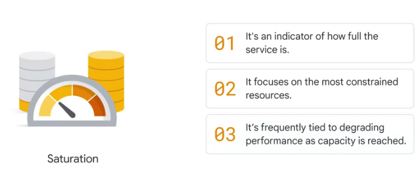

### Saturation 2

### Handling error in cloud

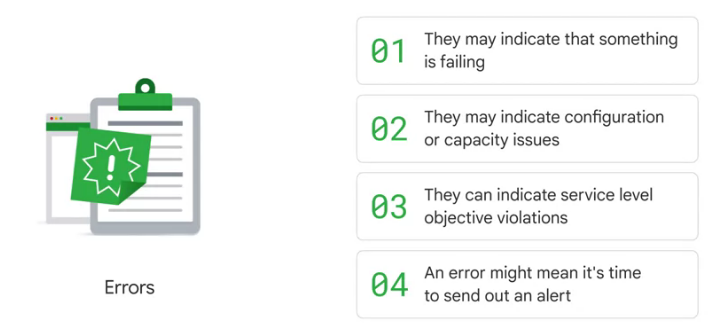

### Handling error in cloud 2


### SLI vs SLO vs SLA

### SLI


Number of good events / count of all valid events

### SLO


### SLO


### SLA


### Improve service reliability

### SLO


### OPS team functions

### Who to maintain OPS


### How to maintain OPS


### Cloud monitoring

### Cloud logging


### Cloud logging

### Cloud logging


### Type of Cloud logging


### Error reporting


### Debugger


### Cloud trace


### Cloud profiler


