# GCP Core Infra

## Why Core Infrastructure

* Identify the purpose and value of Google Cloud
* Choose best deployment environment
* Choose storage options
* Interact and experience google cloud

### GCP service categories

### Cloud advantages

### Evolution of cloud

### Infrastructure as service

* IaaS : Pay for what they allocate
* PaaS : Pay for what they use

### Cloud structure

Google's nine products have more than one billion users each. Google designs and builds its own data centers, which incorporate multiple layers of physical security protections. Access to these datacenters is limited to only a very small number of Google employees. Security features include encryption using centrally managed keys and hardware encryption in hard drives and SSDs. The GFE additionally applies protections against denial-of-service attacks. Google also has multi-tier, multi-layer DoS protections that further reduce the risk of any DoS impact on a service running behind the GFE.

### Cloud cost

Specifically, when you run an instance for more than 25% of a month, Compute Engine automatically gives you a discount for every incremental minute you use for that instance. Custom virtual machine types allow Compute Engine virtual machines to be fine tuned with optimal amounts of vCPU and memory for the applications so that you can tailor your pricing for your workloads.

### Project structure gcp

* folder can contain sub folders
* policies are applied at project, folder and org node level
  * some can be applied at resource level
  * policies are inherited downwards

### Projects in GCP

Attributes of project

* project\_id
* project\_name
* project\_number

### Info about projects

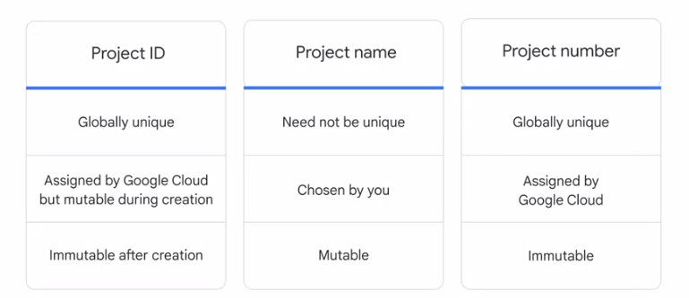

### Resource manager

### Organization nodes

### Top level of org

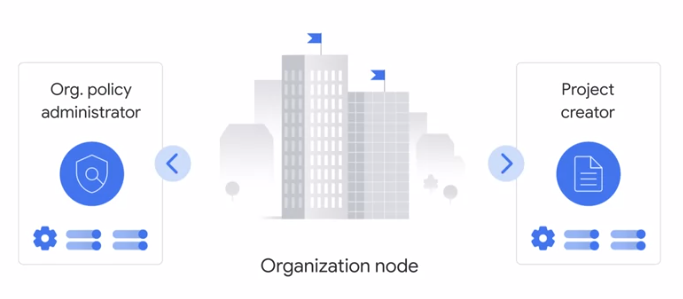

who can do what and on which part

* who can be :
  * a google account
  * a google group
  * service account
  * cloud identity domain
* can do what
  * defined by a role

### Types of IAM

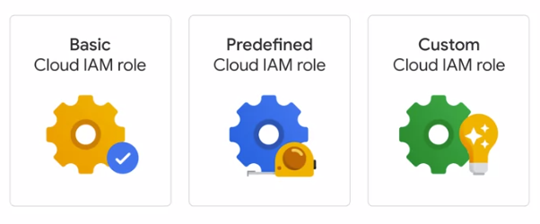

**Basic role**

* Owner
* Editor
* Viewer
* Billing Admin

Can be too general when working with sensitive data

### Basic IAM role

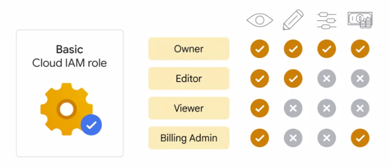

### Pre-define IAM role

### Custom IAM role

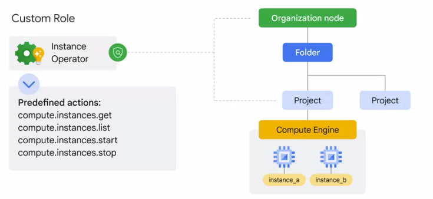

### Custom IAM role

* service accounts do need to be managed

### Service account

### Cloud identity

* more on cloud identity

### Ways to access gcp

## Quiz

Q1 : When would you choose to have an organization node? (Select two)

* When you want to create folders
* When you want to centrally apply organization-wide policies

Q2 : Which statement best describes how Google Cloud resources are associated within the resource hierarchy?

* Google Cloud resources are not associated with the resource hierarchy.

Q3 : Consider a single hierarchy of Google Cloud resources. Which of these situations is possible? (Choose 3 responses.)

* There is no organization node, and there are no folders.
* There is an organization node, and there is at least one folder.

Your company has two Google Cloud projects and you want them to share policies. What is the least error-prone way to set this up?

* Define the new shared policy in the organization node.

Q5 : What is the difference between Identity and Access Management (IAM) basic roles and IAM predefined roles?

* Basic roles can only be granted to single users. Predefined roles can be associated with a group.

Q6 : Select the option that displays IAM roles from general to specific.

* Predefined roles, custom roles, basic roles

Q7 : How does the resource hierarchy control how IAM policies are inherited?

* IAM policies are only implemented at the project level; they cannot be amended by lower levels of the resource hierarchy.

Q8 : Which way of accessing Google Cloud lets you control services through the code you write?

* APIs

### Type of VPC

### Virtual Private Cloud Network ( VPC )

A **virtual private cloud (VPC)** is a secure, isolated private cloud hosted within a public cloud. VPC customers can run code, store data, host websites, and do anything else they could do in an ordinary private cloud, but the private cloud is hosted remotely by a public cloud provider. (Not all private clouds are hosted in this fashion.) VPC's combine the scalability and convenience of public cloud computing with the data isolation of private cloud computing.

You can 

- segment your networks

- use firewall rules to restrict access to instances

- create static routes to forward traffic to specific destinations.

### Compute Engine

- Compute Engine lets you create and run virtual machines on Google infrastructure. 

<figure><figcaption>
range of compute services
</figcaption></figure>

<figure><figcaption>
virtual machine VM lifecycle
</figcaption></figure>

### What are virtual machine

### VM and disk relation

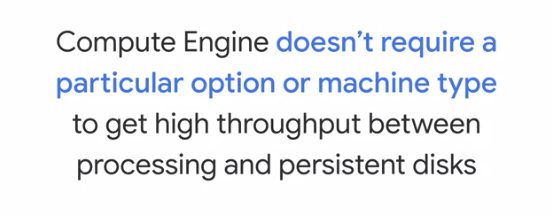

A preemptible VM is different from an ordinary Compute Engine VM in only one respect. Compute Engine has permission to terminate a job if its resources are needed elsewhere. Although savings are possible with preemptible VMs, you need to ensure that your job can be stopped and restarted. In terms of storage, Compute Engine doesn't require a particular option or machine type to get high-throughput between processing and persistent disks.

Let's say, you have a workload that doesn't require a human to sit and wait for it to finish, such as a batch job analyzing a large dataset. You can save money, in some cases up to 90 percent by choosing preemptible VMs to run the job

### Autoscale vs manual scale

### VM upper limit

<figure><figcaption>
general purpose virtual machone
</figcaption></figure>

<figure><figcaption>
compute optimized virtual machone
</figcaption></figure>

<figure><figcaption>
memory optimized virtual machone
</figcaption></figure>

<figure><figcaption>
preemptible virtual machine
</figcaption></figure>

<figure><figcaption>
spot virtual machine
</figcaption></figure>

### App Engine

- The App Engine platform manages the hardware and networking infrastructure required to run your code. To deploy an application on App Engine, you just hand App Engine your code and the App Engine service takes care of the rest. 

- App Engine provides you with a built-in services that many web applications need. App engine will scale your application automatically in response to the amount of traffic it receives. App Engine is especially suited for applications where the workload is highly variable or unpredictable like web applications and mobile backend. 
- App Engine offers two environments: standard and flexible.

- Standard is the simpler. It offers a simpler deployment experience than the Flexible environment and fine-grained auto-scale.  Low utilisation applications might be able to run at no charge. Google provides App Engine SDK's in several languages, so that you can test your application locally before you upload it to the real App Engine service. The SDK's also provide simple commands for deployment.

- In App Engine SE, you use a runtime provided by Google. App Engine Standard Environment provides runtimes for specific versions of Java, Python, PHP and Go. The runtimes also include libraries that support App Engine APIs. The Standard Environment also enforces restrictions on your code by making it run in a so-called "Sandbox." That's a software construct that's independent of the hardware, operating system, or physical location of the server it runs on.

- App Engine flexible environment lets you specify the container your App Engine runs in. App Engine manages these Compute Engine machines for you. They're health checked, healed as necessary, and you get to choose which geographical region they run in, and critical backward-compatible updates to their operating systems are automatically applied. All this so that you can just focus on your code. 

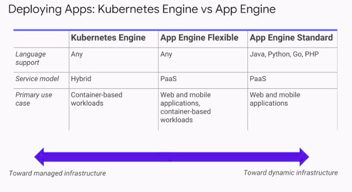

### Routing tables

### Firewall in GCP

### DNS 

### Google's DNS

###  Managed DNS

### Cloud CDN

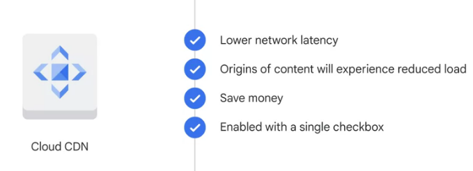

### type of networking

### IPsec VPN protocol

### Direct peering

### Carrier peering

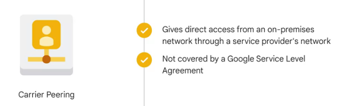

### Dedicated interconnect

### Partner interconnect

### Blob in storage bucket

### GCP cloud storage bucket

### Why use cloud storage

### Blob

### Object version in storage bucket

* Object versioning

### Scope and permisson object storage

### Type of storage options

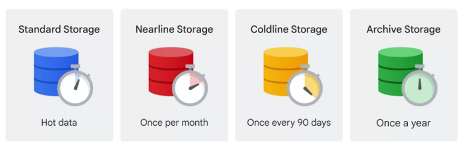

### Type of storage options

### Storage options

### Database & Storage :

- **Cloud Bigtable** uses the interface of the open source database **Apache HBase**.
- **Cloud Dataproc** offers the open source big data environment **Hadoop**, as a managed service.
- **Cloud storage** allows you to save data and files.
- **Cloud SQL** is a fully managed service that makes it easy to set up, manage, and administer relational databases: PostgreSQL, MySQL, and SQL Server.
- **Cloud Spanner** is a NewSQL database developed by Google.
- **Cloud Datastore** is a highly scalable, fully managed NoSQL database service.

### Compute : 

- **Google Stackdriver** lets customers monitor workload across multiple cloud providers.
- **Compute Engine** lets you create and run virtual machines on Google infrastructure. 
- **Kubernetes Engine** secure and managed Kubernetes service.
- **App Engine** fully managed application runtime. Standard & Flexible.
- **Cloud Endpoint** Develop, deploy, protect, and monitor your APIs with Cloud Endpoints.
- **Cloud Functions** Scalable pay-as-you-go (FaaS) to run your code with zero server management.

### Code & Monitoring

- **Cloud Source Repository** Fully featured Git Repo hosted on GCP

### Google Cloud Big Data Platform

- **Cloud Dataflow** fully managed streaming analytics service that minimizes latency, processing time, and cost through autoscaling and batch processing.
- **Big Query**  serverless, highly scalable, and cost-effective data warehouse designed to help you turn big data into informed business decisions.
- **Cloud Pub/Sub** Messaging and ingestion for event-driven systems and streaming analytics.
- **Cloud DataLab** easily explore, visualize, analyze, and transform data using familiar languages, such as Python and SQL

### Google Cloud Machine Learning Platform

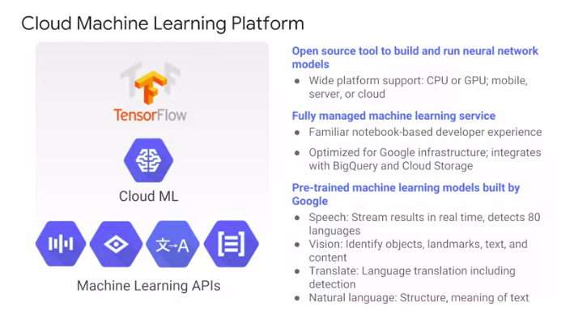

### Cloud SQL

### More info on cloud SQL

### Intro to cloud spanner

### Intro to firestore

### Intro to bigtable

### Type database to choose

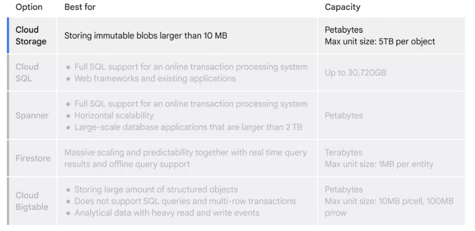

### Google Cloud Storage

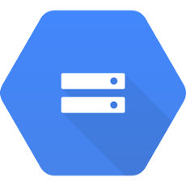

What's object storage? It's not the same as file storage, in which you manage your data as a hierarchy of folders. It's not the same as block storage, in which your operating system manages your data as chunks of disk. Instead, object storage stores arbitrary bunch of bytes with a unique key. often in the form of URLs which means object storage interacts nicely with Web technologies. It's a fully managed scalable service.

Use case 

- serving website content

- storing data for archival and disaster recovery

- distributing large data objects to your end users via Direct Download.

It is comprised of buckets you create and configure and use to hold your storage objects. The storage objects are immutable, you create new versions every time you update. Data in-transit is encrypted using HTTPS. 

### Cloud Storage classes

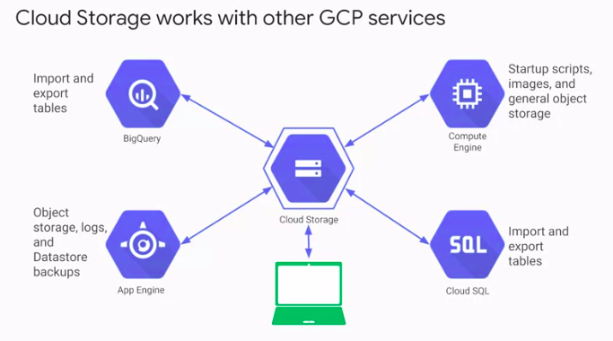

## Cloud Bigtable

Cloud Bigtable is Google's NoSQL, big data database service.

Your databases in Bigtable are sparsely populated tables that can scale to billions of rows and thousands of columns allowing you to store petabytes of data. GCP fully manages the surface. It's ideal for data that has a single lookup key. 

Some applications developers think of Bigtable as a persistent hash table. Cloud Bigtable is ideal for storing large amounts of data with very low latency. It supports high throughput, both read and write,

Use cases : 

- Internet of Things

- user analytics
- financial data analysis. 

## Cloud SQL & Cloud Spanner

- Cloud SQL offers both MySQL and PostgreSQL database engines as a fully managed service, that are capable of handling terabytes of storage. 

- Cloud SQL provides several replica services like read, failover, and external replicas. It can replicate data between multiple zones with automatic failover. It also helps you backup your data with either on-demand or scheduled backups. It can also scale both vertically by changing the machine type, and horizontally via read replicas. 

- Cloud SQL instances include network firewalls, and customer data is encrypted when on Google's internal networks, and when stored in database tables, temporary files, and backups. 

- They are accessible by other GCP services and even external services. You can authorise Compute Engine instances for access Cloud SQL instances and configure the Cloud SQL instance to be in the same zone as your virtual machine. 

- Cloud SQL also supports other applications and tools that you might be used to, like SQL WorkBench, Toad, and other external applications using standard MySQL drivers. 

If Cloud SQL does not fit your requirements because you need horizontal scalability, consider using ***\*Cloud Spanner\****. It offers transactional consistency at a global scale, schema, SQL, and automatic synchronous replication for high availability. And, it can provide petabytes of capacity. Consider using Cloud Spanner if you have outgrown any relational database, or sharding your databases for throughput high performance, need transactional consistency, global data and strong consistency, or just want to consolidate your database.

- Use cases include : 
  - financial applications
  - inventory applications.

## Cloud DataStore

Cloud Datastore highly scalable NoSQL database. One of its main use cases is to store structured data from App Engine apps. It is a from a fully-managed service, Cloud Datastore automatically handles sharding and replication, providing you with a highly available and durable database that scales automatically to handle load. Unlike Cloud Bigtable, it also offers transactions that affect multiple database rows, and it lets you do SQL-like queries. 

### What is a container

### What is kuberentes

### Kubernetes cluster

### Google managed Kubernetes Engine

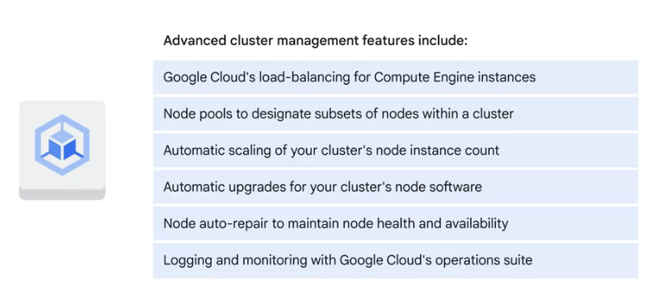

### Hybrid and multi-cloud 

### Anthos

### GKE

### GKE autopilot

### microservice in gCP

### Why container

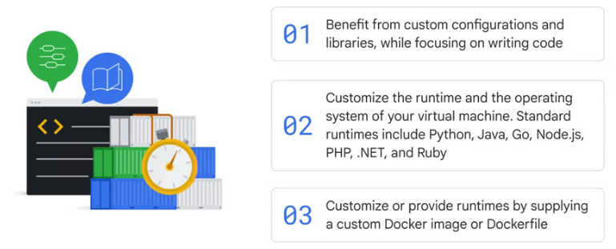

### Standard env vs flexible env

### cloud endpoints

### APIgee Engine

### Cloud RUN

### Simple deployment model

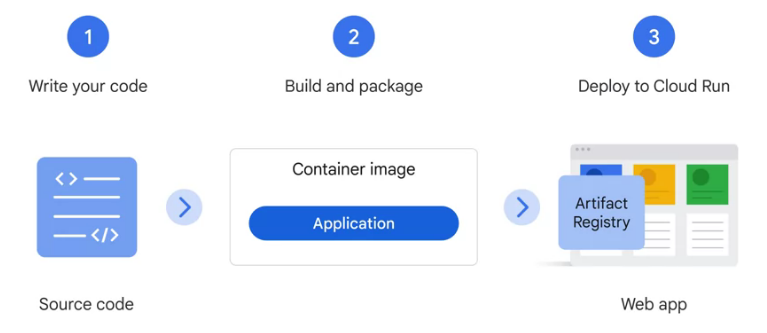

### Cloud functions

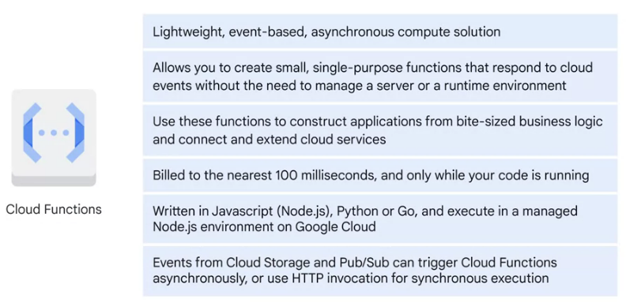

### Intro to terraform

### What is SRE

### Monitoring

### SRE pyramid

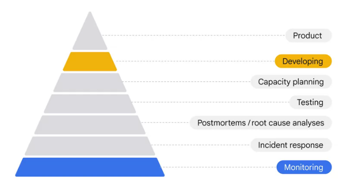

### SRE job

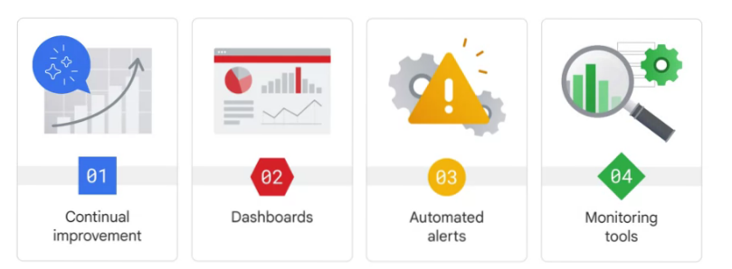

### Latency

### Latency

### Traffic

### Traffic part2

### Saturation

### Saturation 2

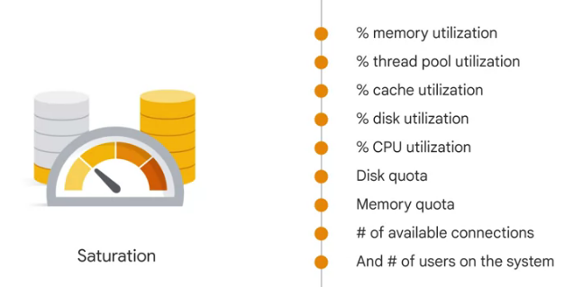

### Handling error in cloud

### Handling error in cloud 2

### SLI vs SLO vs SLA

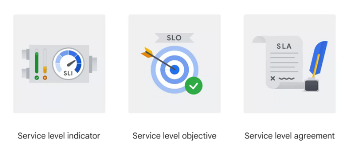

### SLI

Number of good events / count of all valid events

### SLO

### SLO

### SLA

### Improve service reliability

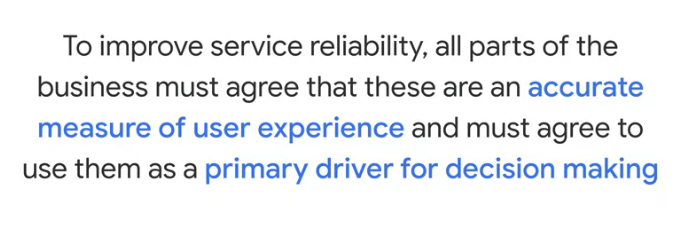

### SLO

### OPS team functions

### Who to maintain OPS

### How to maintain OPS

### Cloud monitoring

### Cloud logging

### Cloud logging

### Cloud logging

### Type of Cloud logging

### Error reporting

### Debugger

### Cloud trace

### Cloud profiler

