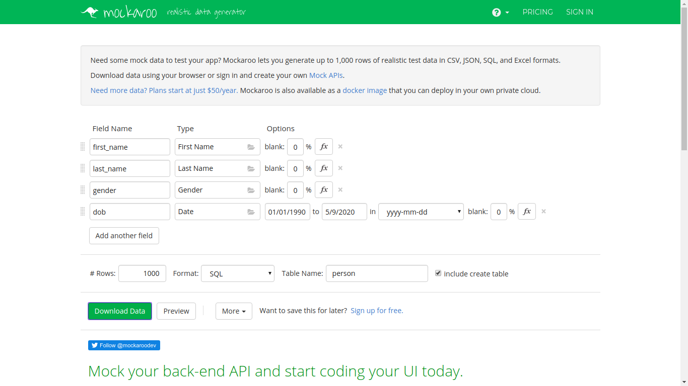
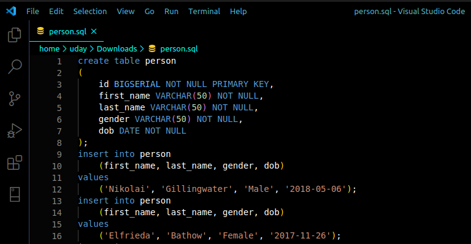

# PostgreSQL

## Setup and Basics

#### Installation

```bash
sudo apt-get install postgresql
```

#### Usage commands

```bash
service postgresql
```

#### Directories

```bash
etc/postgresql/12/main/
```

#### Switch to default user

```text
sudo su postgres
```

#### Launch Postgres shell

```bash
psql
```

## Docker Postgres

```bash
sudo docker pull postgres:13.2-alpine
sudo docker run --name postgres_learn -e POSTGRES_PASSWORD=<password> -d -p 5432:5432 postgres:13.2-alpine
sudo docker exec -it postgres_learn bash
psql -U postgres
```


#### Change password of user

```sql
ALTER USER postgres WITH PASSWORD 'test123';    
-- #semi colon is important
```

#### Create new User

```sql
CREATE USER uday WITH PASSWORD 'test123';        
-- semi colon
```

#### Upgrade user to super user

```sql
ALTER USER dev WITH SUPERUSER;
```

#### Delete \| Drop user

```sql
DROP USER user;
```
!! use only lower or only upper casing, also try to use upper case with command and lowercase with names

### Benefits of Relational Databases

* Efficient storage

There are a lot of information produced from single source of data and hence storing them category-wise in multiple tables in important.

Ex : one table about customer information and another table about order details about customer.

* Easier manipulation

When we need to process some data, then we wont be going through all the data coming from that source.

Ex : while processing orders, you don't need details of customer \(we might in some case\)

* Greater scalability
* Logically models a process
* Tables are related through common values \(keys\)

### Getting Started

### Connect to a database

```sql
psql --help
psql -h localhost -p 5432 -U postgres test
```

1. Here port : 5432 is default and can be get from psql --help
2. postgres is the super user, replace with your user
3. test is the name of database

### Dummy Data

**You can download dummy database from mackaroo.com**



**now make the following changes in `.sql` file**



**Import downloaded SQL database**

```sql
\i /home/uday/Downloads/person.sql
```

### Comments in PostgreSQL

```sql
-- hello
/*
    hello
*/
```