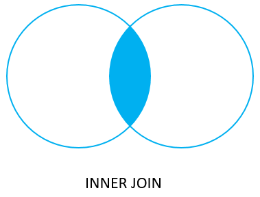

# PostgreSQL Joins

## Joins

### Definition

Allows data retrieval from multiple tables in one query. JOINS are not physical - they persist for the duration of the query execution.

### Best practises with joins

* Make sure you are pre-qualifying names
* Do not make un-necessary joins
* Think about the types of join you are making
* How are connecting records


### Inner Join



The INNER Join keyword select records that have matching values in both sides

* Join type is specific
* join condition is in the FROM clause and uses the ON clause
* Joining tables together affects overall database performance 
* You can join multiple tables.
* List all the tables, then define the condition


```sql
SELECT
    fruit_a,
    fruit_b
FROM
    basket_a
INNER JOIN basket_b
    ON fruit_a = fruit_b;
```

```sql
-- example query
SELECT suppliers.CompanyName,
        ProductName,
        UnitPrice
FROM Supplier 
INNER JOIN Products ON Suppliers.supplierid = Products.supplierid
```

The inner join examines each row in the first table (basket_a). It compares the value in the fruit_a column with the value in the fruit_b column of each row in the second table (basket_b). If these values are equal, the inner join creates a new row that contains columns from both tables and adds this new row the result set.

### Cartesian \(Cross\) Joins

Each row from the first table joins with all the rows of another table. Follows one-to-many relationship,

For ex : 1st table contains : 22 rows and 2nd table contains 77 rows =&gt; there cross join contains = 1694 rows

Not frequently used because:

* Computational taxing
* will return data with incorrect vendor or no vendor at all

```sql
-- example query
SELECT product_name, unit_price, company_name FROM suppliers CROSS JOIN products;
```

### Self Join

Two create a join with itself

```sql
SELECT A.customerName AS customerName1, B.CustomerName AS CustomerName2, A.city
FROM A.customerID = B.customerID
AND A.city = B.city
Order by A.city;
```

### Left Join

### Definition

The left join is going to return all the records from the table on the left side. The table you first state and the matching records with the second table.

```sql
SELECT C.customerName, O.OrderID
FROM Customer C
LEFT JOIN Orders O ON C.cusomterID = O.CustomerID
order by C.customerName;

---

SELECT
    a,
    fruit_a,
    b,
    fruit_b
FROM
    basket_a
LEFT JOIN basket_b 
   ON fruit_a = fruit_b;
```


### Right Join

### Definition

The right join is going to return all the records from the table on the right side. The table you second state and the matching records with the first table.

```sql
SELECT C.customerName, O.OrderID
FROM Customer C
RIGHT JOIN Orders O ON C.cusomterID = O.CustomerID
order by C.customerName;
```

### Unions

### Definition

The UNION operator is used to combine the result-set of two or more SELECT statements. Each SELECT statement within UNION must have the same number of columns. Columns must have similar data types. The columns in each must be in the same order.

```sql
SELECT City, Country FROM Customers
WHERE Country='Germany'
UNION
SELECT City, Country FROM Supplier 
WHERE Country='Germany'
ORDER BY City;
```

