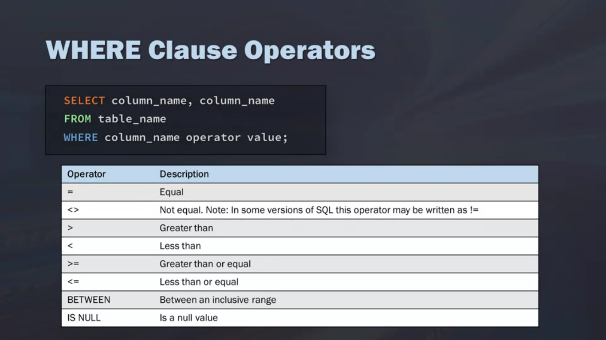

# PostgreSQL Queries

## Queries

```sql
SELECT * FROM person;
```

**to select column from table**

```sql
SELECT first_name,second_name FROM person;
```

| Representation | Function |
| :--- | :--- |
| ASC | Ascending |
| DESC | Descending |

```sql
SELECT * FROM person ORBER BY dob ASC|DESC;
SELECT DISTINCT gender FROM person;
SELECT gender FROM person WHERE gender = 'Female'; 
--to search in one col
SELECT * FROM person WHERE gender = 'Female'; 
--to search whole table where gender = "female"
SELECT * FROM person WHERE gender = 'Male' AND last_name='England';!
```

### Operators

```sql
SELECT 1=1;
SELECT 1<1;
SELECT 1>1;
SELECT 1<=1;
SELECT 1>=1;
SELECT 1<>1; 
-- not
```

```sql
SELECT * FROM person LIMIT 10;
SELECT * FROM person OFFSET 5 LIMIT 10;
SELECT * FROM person OFFSET 5 FETCH FIRST 5 ROW;
SELECT * FROM person WHERE gender IN ('Male');
SELECT * FROM person WHERE gender IN ('Male') AND dob > '2000-01-01' ORDER BY dob ASC;
SELECT * FROM person WHERE email LIKE '%gmail.com';
SELECT * FROM person WHERE email LIKE '%gmail.%;
```

```sql
SELECT * FROM person WHERE last_name LIKE '__i%';
SELECT * FROM person WHERE last_name ILIKE '__i%'; 
-- to ignore the case
```

```sql
SELECT DISTINCT gender FROM person;
SELECT gender,COUNT(*) FROM person GROUP BY gender;
HAVING COUNT(*);
```

### Aggregate functions

```sql
SELECT MAX(price) FROM car;
SELECT make,model,min(price) FROM car GROUP BY make ,model;
SELECT make,sum(price) FROM car GROUP BY make;
```

```sql
SELECT 10*9;
SELECT id,make,model,price,ROUND(price* .10,2),ROUND(price - price*.10,2) FROM car;
SELECT id,make,model,price,ROUND(price* .10,2) AS discount ,
        ROUND(price - price*.10,2) AS after_discount 
FROM car;
```

### Coalesce

```sql
SELECT COALESCE(1) ;
SELECT COALESCE(null,null,1) AS number;
-- It will take the first valid parameter
SELECT COALESCE(email,'email not provided') FROM person;
```

### NULLIF

returns the first argument if false else return null;

```sql
SELECT COALESCE(10/NULLIF(0,0),0);
```

### Date and timestamp

```sql
SELECT NOW();
SELECT NOW()::TIME;
SELECT NOW()::DATE;
SELECT NOW() - INTERVAL '10 YEARS';
SELECT NOW() - INTERVAL '10 MONTHS';
SELECT NOW() - INTERVAL '10 DAYS';
SELECT NOW() + INTERVAL '10 YEARS';
SELECT EXTRACT(YEAR FROM NOW());
SELECT EXTRACT(MONTH FROM NOW());
SELECT EXTRACT(DAY FROM NOW());
SELECT first_name,last_name, AGE(NOW()::DATE,dob) AS age FROM person;
```

### DROPPING

```sql
ALTER TABLE users DROP column created_at;
ALTER TABLE person DROP CONSTRAINT person_ pkey;
```

### Adding primary key

```sql
ALTER TABLE person ADD PRIMARY KEY (id);
ALTER TABLE person ADD CONSTRAINT unique_email UNIQUE(email);
```

### Creating temporary tables

```sql
CREATE TEMPORARY TABLE temp_table(
   SELECT first_name FROM person LIMIT 3;
);
```

### Update

```sql
UPDATE person
SET email = 'not found'
WHERE
    email IS NULL;
```

### Filtering

#### Where clause operator



#### Non match

For not including a particular product :

```sql
Select * from car WHERE name <>'Supra'
SELECT * FROM car WHERE car_price BETWEEN 16 AND 20;
SELECT * FROM car WHERE StorageID IN (8,10,11);
SELECT * FROM car WHERE name = 'supra' OR 'gtr';
SELECT * FROM car WHERE NOT name = 'delhi';
SELECT * FROM car WHERE descpriction = '%supra%'
```

### REGEX

```sql
SELECT DISTINCT CITY FROM STATION
WHERE CITY  REGEXP '^[aeiou].*[aeiou]$';
```

### Sub Queries

#### Definition

In essence, sub queries are queries embedded into other queries. Relational databases store data in multiple tables. Sub queries merge data from multiple sources together. Helps with adding other filtering criteria.

```sql
SELECT CustomerId, region, freight from Customers WHERE CustomerID in (
    SELECT CusomterId from Orders WHERE freight > 100
);
```

**Sub Query always process the innermost query first and work outwards**

SQL performs the inner most query first. \(logical\)

#### Sub Queries best practises

* No limit to number of sub query
* **performance slow down when you nest**
* sub query selects select only retrieve a single column
* indent the sub query is properly indented : [formater](http://poorsql.com/)

#### Sub Queries for calculations :

```sql
SELECT customer_name, customer_state (
    SELECT COUNT(*) AS orders
    FROM orders
    WHERE Orders.customer_id = Customer.customer_id
) AS orders
FROM customers
ORDER BY customer_name
```

