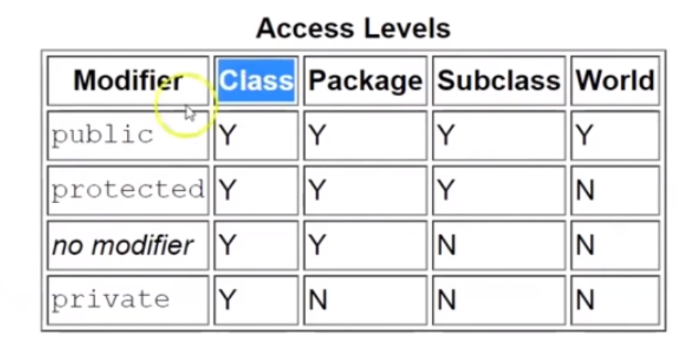

# Object Oriented Programming

Tags: oops

- Class : A Logical Entity
    - Have some attributes
    - Have some behavior
- Object : A Instance of Class
- Access Modifier

- Inheritance : the usual
    - types :
        - Single Inheritance : single parent : single child
        - Multilevel Inheritance : single parent -> one child -> child
        - Hierarchical Inheritance : single parent -> multiple child
        - Hybrid Inheritance : combination of one or more inheritance
- Encapsulation : packing up all requirements in one entity and conditions on top of it for appropriate usage.
- Abstraction : hiding the internal details and working
    - abstract class : cannot be instantiated — implementation class will have to override
    - abstract method : cannot be implemented — implementation class will have to override
    - GraphicObject object = new Circle()
    - GraphicObject is the abstract class, Circle is its concrete implementation
- Polymorphism : Interfaces