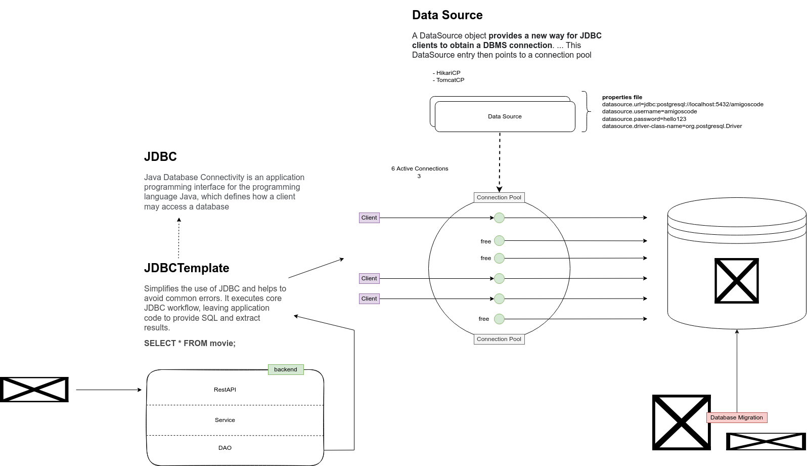

# JDBC



### pom.xml

```markup
<!-- for jdbc -->
<dependency>
	<groupId>org.springframework.boot</groupId>
	<artifactId>spring-boot-starter-data-jdbc</artifactId>
</dependency>

<!-- for migrations of table to db -->
<dependency>
	<groupId>org.flywaydb</groupId>
	<artifactId>flyway-core</artifactId>
</dependency>
```

### Configuration for PostgreSQL

```java
// FOR JDBC
app:
  datasource:
    main:
      driver-class-name: org.postgresql.Driver
      jdbc-url: jdbc:postgresql://[host]:[port]/[db name]
      username: [username]
      password: [password]
      pool-size: [pool size]
      
server:
  error:
    include-binding-errors: always
    include-message: always
  
```

### For flyway migration

* If you are using Flyway for db migration, create a folder `db/migrations` inside resource folder
  * Name the migration `V[number]__[name of migration].sql`
  * Example : `V1__InitTables.sql`

### Configuring `HikariDataSource`

```java
@Configuration
public class DataSouceConfig {

	@Bean
	@Primary
	// to get the required environment variable from configuration
	@ConfigurationProperties(prefix = "app.datasource.main")
	public HikariDataSource hikariDataSource() {
		return DataSourceBuilder.create()
		.type(HikariDataSource.class).build();
	}

	@Bean
	public JdbcTemplate jdbcTemplate(HikariDataSource hikariDataSource) {
		return new JdbcTemplate(hikariDataSource);
	}

}
```

### Queries

```java
// select statement
String sql = "SELECT * FROM table;";
return jdbcTemplate.query(sql, new TRowMapper());

// insert statement
String sql = """insert into table (col1, col2) values (?, ?);""";
return jdbcTemplate.update(sql, value1, value2);

// delete statement
return jdbcTemplate.update("delete from table where id = ?", id);

// with condition
String sql = "SELECT * FROM table where id = ?;";
List<T> movies = jdbcTemplate.query(sql, new TRowMapper(), id);
return movies.stream().findFirst();
```

### `RowMapper<T>`

```java
public class TRowMapper implements RowMapper<T> {

	@Override
	public T mapRow(ResultSet rs, int rowNum) throws SQLException {
		return new Movie(
			rs.getInt("id"), rs.getString("column_name"), List.of(),
			LocalDate.parse(rs.getString("column_name"))
		);
	}
}
```
