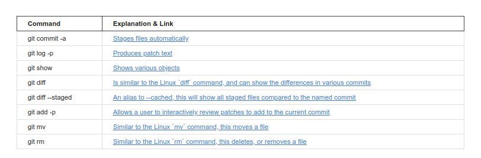

# Git version Control

## Basic and Git Configuration

* version : `git --version`
* git directory \[ Linux \] : `which git` 

**Setting your user name and email :**

* You need to set who you are _before_ creating any commit. That will allow commits to have the right author name and email associated to them.
* ```text
  $ git config --global user.name "Your Name"
  $ git config --global user.email mail@example.com
  ```
* Remove a global identity :
  * ```text
    $ git config --global --remove-section user.name
    $ git config --global --remove-section user.email
    ```

**Basic Commands**

* Create an empty Git repository: `git init`
  * This creates a hidden folder, .git , which contains the plumbing needed for Git to work.
* Check status : `git status`
* Adding files to staging area : 
  * `git add <directory/filename>` \[for single file\]
  * `git add .`  or `git add --all` \[for all changed files\]
* Commit all files : 
  * `git commit` \[this opens your Git's default code editor\]
* To commit files with short message : 
  * `git commit -m "commit msg"`
* To add the remote location of git : 
  * `git remote add origin https://<your-git-service-address>/owner/repository.git`
* Cloning a Repo : 
  * `git clone https://github.com/username/projectname.git`
* To specify a different name of the directory, example `MyFolder` :
  * `git clone https://github.com/username/projectname.git MyFolder`
* To clone in current directory : 
  * `git clone https://github.com/username/projectname.git .`
* To push your code to upstream :
  * `git push --set-upstream origin main` or `git push origin`
* Check the remote names: 
  * `git remote -v`
* To get help about any command : 
  * `git <command> --help`

### Logging

* To view log  :
  * `git log`
  * `git log --stat`  \[ for detailed view \]
* To view log more beautifully :
  * `git log --decorate --oneline --graph`
* Create alias commands : 
  * `git config --global alias.mylog "log --decorate --oneline --graph"`
  * To run  :  `git mylog`
* To view logs in oneline :
  * `git log --oneline`
* To see commit using commit id : `git show <commit id>`

### Working with Remote Repositories

* List remote location :
  * `git remote -v`
* If a remote branch has been deleted, your local repository has to be told to prune the reference to it
  * `git fetch [remote-name] --prune`
* Updating from Upstream Repository
  * ```text
    git fetch remote-name
    git merge remote-name/branch-name
    ```
  * The pull command combines a fetch and a merge : `git pull`
  * `git pull --rebase remote-name branch-name`
* Syntax for pushing to a remote branch :
  * `git push <remote_name> <branch_name>`
* Rename remote :
  * `git remote rename origin destination`

## Diff & Patch



### Differences

1. To see new changes made

```text
git diff
```

1. To see difference between two files :

```text
diff code1.js code2.js
```

1. or use **-u** to show more detailed view of diff

```text
diff -u code1.js code2.js
```

1. to generate differences between two file in another file

```text
diff code1.js code2.js > change.diff
// or
diff -u code1.js code2.js > change.diff
```

1. To see staged changes

   ```text
   git diff --staged
   ```

### Patch

1. In order to patch the changes

   ```text
   patch code1.js < change.diff
   ```

   **Logging details about commits**

2. To commit all files without going through git add

```bash
git commit -a -m "commit message"
```

1. To get more details about the project 

```text
git log -p
```

1. to see patch file to another commit, we use commit id

```text
git show b09ddf8a0000055f50386f1aa938f4b8a7b43b0c
```

1. to get stats about your commits

```text
git log --stat
```

1. to see details while adding

   ```text
   git add -p
   ```

2. to see details on last n commit \(example of 2\)

   ```text
   git log -p -2
   ```

### File Management

1. to rename file that is being tracked by git

```text
git mv old_file_name new_file_name
```

1. to delete a file use : 

```text
git rm file_to_be_delete
```

1. to revert change of a file, use : 

```text
git checkout file_name
```

1. to remove a file from being tracked by git, use : 

```text
git reset HEAD file_name
```

1. to change the commit msg/ or to overwrite last commit:

```text
git commit --amend
```

1. to revert HEAD :

```text
git revert HEAD
```

1. to see details on last n commit \(example of 2\)

   ```text
   git log -p -2
   ```

-2 to see the last two commit, becoz revert doesnt delete the faulty commit, it roles back head while keeping the fault.

To create a new branch :

```text
git branch name_of_new_branch
```

