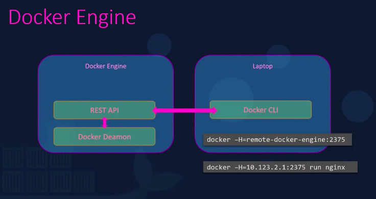

# Basics

### Troubleshooting and Debugging

Troubleshooting : the process of identifying, analyzing and solving problems

Debugging : the process of identifying, analyzing and removing bugs in a system

* Troubleshooting is for infrastructure
  * tcpdump, wireshark
  * strace, ltrace
  * ps, top etc
* Debugging : is for Software application
* Debugger : follows the code line by line , inspect changes in variable assignments, interrupt the program when a specific condition is met and more

**Steps to solve any issue**

* Getting Information to understand the problem
* Isolate and finding the root cause
* Performing the necessary remediation
* Document what we do
  * The different things we tested to try
  * Figure out the root cause.
  * The steps we took to fix the issue.

**strace : to trace system calls made by the program**

* o file.strace : to save output of trace to a file

### Main steps to solving any issue ?

<figure><figcaption></figcaption></figure>

### Isolating the root cause is super important

* Load average : amount of time the process is busy in a minute
* load average 1 means it was busy for whole min.
* shouldn’t be above the amount of process in computer

#### Reproduction Case

* Read the logs
* Linux
  * /var/log/syslog
  * .xsession-errors
* MacOS : Library/Logs/
* Windows : EventViewer

<figure><figcaption></figcaption></figure>

Our solution dont come up by wandering about things, we have to look at information to plug things into our knowledge graph. looking at error messages or documentation

**Get a reproduction, try to isolate the problem**

**Understanding the root cause is super important**

* iostat :
* iotop :
* vmstat :
* ionice :
* iftop :
* rsync -bwlimit
* trickle
* ab
* nice & renice
* time
* kill command

Like isolating causes, understanding error messages, adding logging information, and generating new ideas for possible failures.

**First apply intermittent solution, then apply the full solution**

[https://www.coursera.org/learn/troubleshooting-debugging-techniques/lecture/KjI30/internal-server-error](https://www.coursera.org/learn/troubleshooting-debugging-techniques/lecture/KjI30/internal-server-error)
